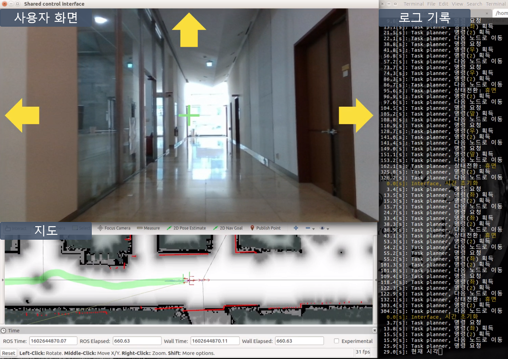

# [minibot_control](https://github.com/Taemin0707/minibot_control)
본 패키지는 이동로봇(minibot)의 공유제어를 담당한다. 이동로봇은 Generalized Voronoi Graph(GVG)를 참고하여 목적지를 결정하며, GVG에서 교차로가 발생하면 Brain-Computer Interface(BCI)에게 선택을 요청하는 식으로 목적지에 도달한다. 또한 목적지로 이동 시에는 보행자를 인식하여 능동적 회피를 진행한다.

> 개발자 노진홍
> <br> 박사후연구원, 지능로봇연구단, 한국과학기술연구원
> <br> fini@kist.re.kr
> <br> 02-958-4864

> 개발자 최태민
> <br> 인턴, 지능로봇연구단, 한국과학기술연구원
> <br> choitm0707@kist.re.kr
> <br> 02-958-4864
---
## 1. 개요
### 1.1. 목표
조이스틱 사용자 대비 이동시간 ~~300%~~ ~~200%~~ 150% 이내(2020년 기준)에 정해진 목적지에 도달

### 1.2. 방침
-  로봇은 자신의 위치를 GVG 수준에서 파악할 수 있으며, 인접한 노드들을 이동대상으로 본다.
- 로봇은 교차로에 도달하면 사용자에게 navigational cue를 제공한다.
- 사용자는 motorimagery로 경로의 방향을 결정한다.
- 사용자는 eye blink로 경로선택을 보조하거나 휴면상태를 해제할 수 있다.

### 1.3. 협업구조
- 김래현박사님팀
    - 실무자: 김다혜(dahyekim@kist.re.kr), 윤주석(juseok5462@kist.re.kr), 권장호(g15007@kist.re.kr), 오승준(ohseungjun@kist.re.kr), 박상인(sipark@kist.re.kr)
    - 역할: BCI로 사용자의 의도를 획득한다.
- 최종석박사님팀
    - 노진홍(fini@kist.re.kr)
    - 역할: BCI-이동로봇을 위한 공유제어를 설계한다.
    - 최태민(choitm0707@kist.re.kr)
    - 역할: BCI-이동로봇의 보행자 인식 및 회피기능을 추가한다.

### 1.4. 변경점
- `1.0.0` 노드 사이의 프로토콜 확립, `1.0.1` Task planner 구축, `1.0.2` Gazebo 연결, `1.0.3` Interface visualizer 구축, `1.0.4` 좌표계 구축
- `1.1.0` 실제 BCI와 연결, `1.1.1` 평가 모듈 추가, `1.1.2` Joystick 추가, `1.1.3` 그래프 수동작성기능 추가
- `1.2.0` 행동방침 변경, `1.2.1` 실행파일 인자 공유, `1.2.2` Motion manager 인터럽트 기능 추가
- `1.3.0` 이동로봇-BCI 인터페이스 개선, `1.3.1` 지도 확장, `1.3.2` 노드 마운트 초기화, `1.3.3` 로봇의 상태 발행
- `1.4.0` 교차로 대응방식 변경, `1.4.1` Eyeblink 인터페이스 조정, `1.4.2` 경로계획법 튜닝
- `1.5.0` Local planner 변경, `1.5.1` 정지자세 교정, `1.5.2` 주행시야 갱신
- `1.6.0` 1인칭 인터페이스 추가, `1.6.1` 다음 경로의 형태 발생, `1.6.2` 키보드 인터페이스 결합, `1.6.3` 전체화면모드 적용
- `1.7.0` 이동로봇-BCI 인터페이스 개편, `1.7.1` 실행주체 분리, `1.7.2` 노드 이동, `1.7.3` 주행정보 기록
- `1.8.0` 단순화 버전 추가
- `2.0.0` 보행자 인식 및 회피기능 추가
---
## 2. 설치
### 2.1. 개발환경
- **미니봇(made by robocare)**
    - 하드웨어
        - Intel NUC PC(i7)
        - Intel Realsense D415 Camera(추가)
    - 소프트웨어
        - Ubuntu MATE 16.04
        - ROS kinetic
        - Python 2.7
    
- **Nvidia Jetson Nano**
    - 소프트웨어
        - Jetpack 4.3 [L4T 32.3.1]
        - ROS melodic
        - Python 3.6
    
- **BCI 사용자용 컴퓨터**
    - 하드웨어
        - Lenovo Thinkpad(i5)
        - xbox360 controller
    - 소프트웨어
        - Ubuntu 16.04
        - ROS kinetic
        - Python 2.7

### 2.2. 설치순서
- **미니봇(made by robocare)**
    1. [Intel Realsense SDK 2.0 설치](https://github.com/IntelRealSense/librealsense/blob/master/doc/distribution_linux.md)
        - Register the server's public key:
          `sudo apt-key adv --keyserver keys.gnupg.net --recv-key F6E65AC044F831AC80A06380C8B3A55A6F3EFCDE || sudo apt-key adv --keyserver hkp://keyserver.ubuntu.com:80 --recv-key F6E65AC044F831AC80A06380C8B3A55A6F3EFCDE`
        - Add the server to the list of repositories:
          `sudo add-apt-repository "deb http://realsense-hw-public.s3.amazonaws.com/Debian/apt-repo xenial main" -u`
        - Install the libraries (see section below if upgrading packages):
          `sudo apt-get install librealsense2-dkms` &&
          `sudo apt-get install librealsense2-utils`
        - Reconnect the Intel RealSense depth camera and run: `realsense-viewer` to verify the installation

    2. [ROS medlodic](http://wiki.ros.org/melodic/Installation/Ubuntu) 설치
        - Setup your sources.list<br/>
        `sudo sh -c 'echo "deb http://packages.ros.org/ros/ubuntu $(lsb_release -sc) main" > /etc/apt/sources.list.d/ros-latest.list'`
        - Set up your keys<br/>
        `sudo apt-key adv --keyserver 'hkp://keyserver.ubuntu.com:80' --recv-key C1CF6E31E6BADE8868B172B4F42ED6FBAB17C654`
        - Installation<br/>
        `sudo apt update` <br/>
        `sudo apt install ros-melodic-desktop-full`

    2. workspace 생성
        ```
        $ mkdir -p ~/mini_ws/src
        $ cd ~/mini_ws/
        $ catkin_make
        ```

    3. Turtlebot3 설치안내 중 [PC setup](http://emanual.robotis.com/docs/en/platform/turtlebot3/pc_setup/) 파트를 따라 설치
        ```
        sudo apt-get install ros-kinetic-joy ros-kinetic-teleop-twist-joy ros-kinetic-teleop-twist-keyboard ros-kinetic-laser-proc ros-kinetic-rgbd-launch ros-kinetic-depthimage-to-laserscan ros-kinetic-rosserial-arduino ros-kinetic-rosserial-python ros-kinetic-rosserial-server ros-kinetic-rosserial-client ros-kinetic-rosserial-msgs ros-kinetic-amcl ros-kinetic-map-server ros-kinetic-move-base ros-kinetic-urdf ros-kinetic-xacro ros-kinetic-compressed-image-transport ros-kinetic-rqt-image-view ros-kinetic-gmapping ros-kinetic-navigation ros-kinetic-interactive-markers

        $ cd ~/mini_ws/src/
        $ git clone https://github.com/ROBOTIS-GIT/turtlebot3_msgs.git
        $ git clone -b kinetic-devel https://github.com/ROBOTIS-GIT/turtlebot3.git
        $ cd ~/mini_ws && catkin_make
        ```

    3. minibot_control 외 필요한 패키지들을 설치
        ```
        $ cd ~/mini/ws/src
        $ git clone https://github.com/robopeak/rplidar_ros.git
        $ sudo apt install python-pip ros-kinetic-teb-local-planner ros-kinetic-usb-cam
        $ pip install --user networkx==2.1 pygame
        $ git clone https://github.com/Taemin0707/minibot_control
        $ cd ~/mini_ws
        $ catkin_make
        ```

- **Nvidia Jetson Nano**
    1. micro SD 카드에 Jetpack 4.3 [L4T 32.3.1] 설치
        - [Jetpack 4.3 [L4T 32.3.1]](https://developer.nvidia.com/jetpack-43-archive)
    2. 모니터링 유틸리티 [Jetson stats](https://github.com/rbonghi/jetson_stats) 설치 
        ```
        $ sudo apt-get install
        $ sudo -H pip install -U jetson-stats
        ```
    3. ROS medlodic 설치
        - Setup your sources.list<br/>
        `sudo sh -c 'echo "deb http://packages.ros.org/ros/ubuntu $(lsb_release -sc) main" > /etc/apt/sources.list.d/ros-latest.list'`
        - Set up your keys<br/>
        `sudo apt-key adv --keyserver 'hkp://keyserver.ubuntu.com:80' --recv-key C1CF6E31E6BADE8868B172B4F42ED6FBAB17C654`
        - Installation<br/>
        `sudo apt update` <br/>
        `sudo apt install ros-melodic-desktop-full`

    4. Opencv 다운그레이드(버전 4에서 3으로)
        - 이유: ROS python3 cv_brdige를 사용하려면 빌드시 다운그레이드 필요
        - [참고한 코멘트](https://github.com/ros-perception/vision_opencv/issues/329#issuecomment-636270193)

        - `apt list -a libopencv-dev` 명령어으로 아래와 같은 결과를 확인
            ```
            Listing... Done
            libopencv-dev/stable 4.1.1-2-gd5a58aa75 arm64 [upgradable from: 3.2.0+dfsg-4ubuntu0.1]
            libopencv-dev/bionic-updates,bionic-security,now 3.2.0+dfsg-4ubuntu0.1 arm64 [installed,upgradable to: 4.1.1-2-gd5a58aa75]
            libopencv-dev/bionic 3.2.0+dfsg-4build2 arm64
            ```
        - `sudo apt install libopencv-dev=3.2.0+dfsg-4ubuntu0.1`
        - jetson stats을 실행시켜 다운그레이드 결과 확인
    
    5. TensorRT Yolo v4 패키지 설치
        - [jkjung-avt / tensorrt_demos](https://github.com/jkjung-avt/tensorrt_demos)
            1. Basic set-up
                ```
                ### Set proper environment variables
                $ mkdir ${HOME}/project
                $ cd ${HOME}/project
                $ git clone https://github.com/jkjung-avt/jetson_nano.git
                $ cd jetson_nano
                $ ./install_basics.sh
                $ source ${HOME}/.bashrc
                ```
            2. Making sure python3 'cv2' is working (2~3시간 정도 소요)
                ```
                ### Install dependencies for python3 'cv2'
                $ sudo apt-get update
                $ sudo apt-get install -y build-essential make cmake cmake-curses-gui \
                                        git g++ pkg-config curl libfreetype6-dev \
                                        libcanberra-gtk-module libcanberra-gtk3-module
                $ sudo apt-get install -y python3-dev python3-testresources python3-pip
                $ sudo pip3 install -U pip Cython
                $ cd ${HOME}/project/jetson_nano
                $ ./install_protobuf-3.8.0.sh
                $ sudo pip3 install numpy matplotlib
                ```
            3. Install "pycuda"
                ```
                $ cd ${HOME}/project/tensorrt_demos/ssd
                $ ./install_pycuda.sh
                ```
            4. Install version "1.4.1" (not the latest version) of python3 "onnx" module
                ```
                $ sudo pip3 install onnx==1.4.1
                ```
            5. Go to the "plugins/" subdirectory and build the "yolo_layer" plugin. When done, a "libyolo_layer.so" would be generated.
                ```
                $ cd ${HOME}/project/tensorrt_demos/plugins
                $ make
                ```
            6. Download the pre-trained yolov3/yolov4 COCO models and convert the targeted model to ONNX and then to TensorRT engine.
                ```
                $ cd ${HOME}/project/tensorrt_demos/yolo
                $ ./download_yolo.sh
                $ python3 yolo_to_onnx.py -m yolov4-tiny-416
                $ python3 onnx_to_tensorrt.py -m yolov4-tiny-416
                ```
    6. [Setup ROS with python3](https://medium.com/@beta_b0t/how-to-setup-ros-with-python-3-44a69ca36674)
        1. Basic Setup
            ```
            sudo apt-get install python3-pip python3-yaml
            sudo pip3 install rospkg catkin_pkg
            ```
        2. cv_bridge Setup
            ```
            $ sudo apt-get install python-catkin-tools python3-dev python3-numpy

            $ mkdir ~/catkin_build_ws && cd ~/catkin_build_ws
            $ catkin config -DPYTHON_EXECUTABLE=/usr/bin/python3 -DPYTHON_INCLUDE_DIR=/usr/include/python3.6m -DPYTHON_LIBRARY=/usr/lib/aarch64-linux-gnu/libpython3.6m.so
            $ catkin config --install

            $ mkdir src
            $ cd src
            $ git clone -b melodic https://github.com/ros-perception/vision_opencv.git

            $ cd ~/catkin_build_ws
            $ catkin build cv_bridge
            $ source install/setup.bash --extend
            ```

    7. ~./bashrc 추가 (**ROS_IP & ROS_MASTER_URI는 상황에 따라 변경**)
        ```
        source /opt/ros/melodic/setup.bash
        source ~/catkin_ws/devel/setup.bash

        # set aliases for Ubuntu
        alias eb='gedit ~/.bashrc'
        alias sb='source ~/.bashrc'

        export ROS_IP=10.42.0.161
        export ROS_MASTER_URI=http://172.16.0.7:11311

        source ~/catkin_build_ws/install/setup.bash --extend
        ```

- **BCI 사용자용 컴퓨터**
    - 미니봇과 동일
    - 추가적으로 xbox360 controller 설치 필요<br/>
        `sudo apt install python-pip xboxdrv`

### 2.3. 네트워크 설정 방법
- **로봇과 나노 그리고 서버의 ROS 네트워크를 설정한다.**
    - [Setting Up a ROS network: WiFi + Ethernet](https://risc.readthedocs.io/2-ros-network-wifi-ethernet.html)

### 2.4. 데모 방법
- **미니봇(made by robocare)**
    - Terminal 1: <br/>
        ```
        roscore
        ```
    - Terminal 2: <br/>
        ```
        roslaunch shared_control navigation.launch
        ```
    
- **Nvidia Jetson Nano**
    - Terminal 1: <br/>
        ```
        roslaunch pedestrian_tracking jetson_python3.launch
        ```
    - Terminal 2: <br/>
        ```
        $ cd ${HOME}/project/tensorrt_demos
        $ python3 trt_yolo_ros.py -m yolov4-tiny-416
        ```

- **BCI 사용자용 컴퓨터**
    - Terminal 1: <br/>
        ```
        $ sudo rmmod xpad
        $ sudo xboxdrv
        $ roslaunch shared_control start.launch
        ```
    - a(왼쪽) | d(오른쪽) | w(앞) | 2(두 번 깜빡임) | 3(세 번 깜빡임)
    - 조이스틱
        - start: 시간 초기화
        - back: 시간 기록
        - 왼쪽 위 방향키: 이동
    - 휴면 상태에서 두 번 깜박임으로 상태 전환

### 2.5. BCI 사용자 화면
<br/>


### 2.6. Subscribed topic for BCI

- `interf/cmd/intuit`: 로봇에게 이동방향을 지시한다.
  - `header`
  - `dir` = {1: 오른쪽, 2: 왼쪽, 3: 앞}
- `interf/cmd/assist`: 로봇에게 행동시점을 지시한다.
  - `header`
  - `num` = {2: 교차로에서 회전정지시점, 혹은 말단노드 탈출시점}

### 2.6. Published topic for BCI

- `interf/nav_cue`: 도달예정인 교차로의 정보를 제공한다.
  - `header`
  - `dist` = 교차로와의 거리
  - `right` = 오른쪽 경로의 수
  - `left` = 왼쪽 경로의 수
  - `forward` = {0: 전방경로 없음, 1: 전방경로 있음}
  - `backward` = {0: 후방경로 없음, 1: 후방경로 있음}
- `interf/robot/motion`: 로봇이 선택한 움직임을 알린다.
  - `header`
  - `motion` = {1: 오른쪽, 2: 왼쪽, 3: 앞, 4: 뒤, 5: 정지, 6: 알림, 7: 이동}

### 2.7 Subscribed topic for Pedestrian Tracking

- `recognition/pedestrian_infos`: 인식된 보행자의 위치 정보를 제공한다.
    - `header`
    - `pedestrian_infos` = 정보들
        - `id` = 인식 번호
        - `point` = 위치 좌표

### 